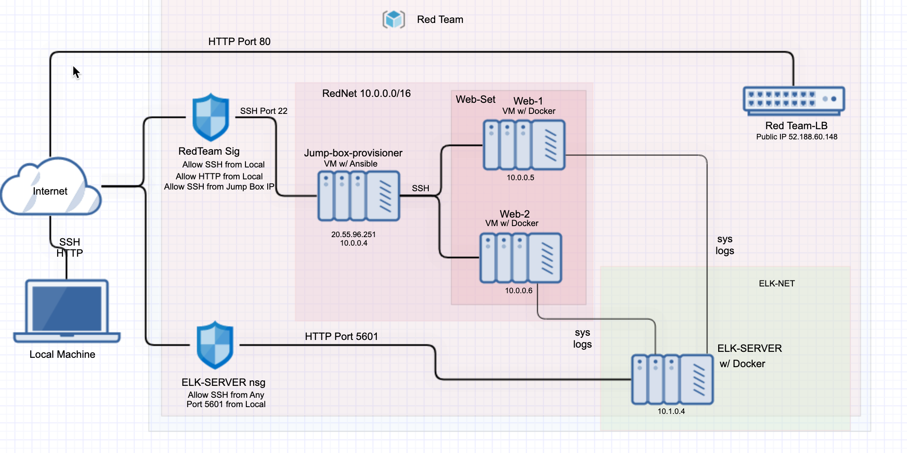
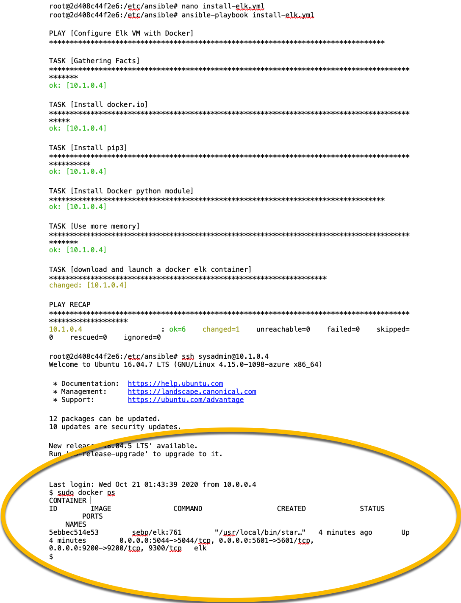

## Automated ELK Stack Deployment

The files in this repository were used to configure the network depicted below.




These files have been tested and used to generate a live ELK deployment on Azure. They can be used to either recreate the entire deployment pictured above. Alternatively, select portions of the YAML file may be used to install only certain pieces of it, such as Filebeat.

[install_elk.yml](Playbooks/install_elk.yml)

 ```
# install_elk.yml
- name: Configure Elk VM with Docker
  hosts: elkserver
  remote_user: sysadmin
  become: true
  tasks:
    # Use apt module
    - name: Install docker.io
      apt:
        update_cache: yes
        name: docker.io
        state: present

      # Use apt module
    - name: Install pip3
      apt:
        force_apt_get: yes
        name: python3-pip
        state: present

      # Use pip module
    - name: Install Docker python module
      pip:
        name: docker
        state: present

      # Use command module
    - name: Increase virtual memory
      command: sysctl -w vm.max_map_count=262144

      # Use sysctl module
    - name: Use more memory
      sysctl:
        name: vm.max_map_count
        value: "262144"
        state: present
        reload: yes

      # Use docker_container module
    - name: download and launch a docker elk container
      docker_container:
        name: elk
        image: sebp/elk:761
        state: started
        restart_policy: always
        published_ports:
          - 5601:5601
          - 9200:9200
          - 5044:5044
  ```
    

This document contains the following details:
- Description of the Topology
- Access Policies
- ELK Configuration
  - Beats in Use
  - Machines Being Monitored
- How to Use the Ansible Build


### Description of the Topology

The main purpose of this network is to expose a load-balanced and monitored instance of DVWA, the D*mn Vulnerable Web Application.

Load balancing ensures that the application will be highly available, in addition to restricting in-bound access to the network.

- A load balancer intelligently distributes traffic from clients across multiple servers without the clients having to understand how many servers are in use or how they are configured. Because the load balancer sits between the clients and the servers it can enhance the user experience by providing additional security, performance, resilience and simplify scaling your website.


What is the advantage of a jump box?
- A jump box is a secure computer that all admins first connect to before launching any administrative task or use as an origination point to connect to other servers or untrusted environments.


Integrating an ELK server allows users to easily monitor the vulnerable VMs for changes to the jumpbox and system network_.
-What does Filebeat watch for? 
Changes to file changes on the machine.
-What does Metricbeat record?
collect metrics from the operating system and from services running on the server.

The configuration details of each machine may be found below.

| Name      | Function  | IP Address | Operating System |
|-----------|-----------|------------|------------------|
| Jump Box  | Gateway   | 10.0.0.4   | Linux            |
| Web-1     | Webserver | 10.0.0.5   | Linux            |
| Web-2     | Webserver | 10.0.0.6   | Linux            |
| ELK-Server| Monitoring| 10.1.0.4   | Linux            |
 

### Access Policies

The machines on the internal network are not exposed to the public Internet. 

Only the jump box provisioner machine can accept connections from the Internet. Access to this machine is only allowed from the following IP addresses:
- 5061 Kibana Port

Machines within the network can only be accessed by jump box provisioner.

Which machine did you allow to access your ELK VM? 
- My IP Address: 72.179.7.89

A summary of the access policies in place can be found in the table below.

| Name      | Publicly Accessible | Allowed IP Addresses |
|---------- |---------------------|----------------------|
| Jump Box  | Yes                 | 72.179.7.89          |
| Web-1     | No                  | 10.1.0.4             |
| Web-2     | No                  | 10.1.0.4             |
| ELK-Server| No                  | 10.1.0.4             |

### Elk Configuration

Ansible was used to automate configuration of the ELK machine. No configuration was performed manually, which is advantageous because...
 **What is the main advantage of automating configuration with Ansible?**
- Free: Ansible is an open-source tool.
- Very simple to set up and use: No special coding skills are necessary to use Ansible’s playbooks (more on playbooks later).
- Powerful: Ansible lets you model even highly complex IT workflows. 
- Flexible: You can orchestrate the entire application environment no matter where it’s deployed. You can also customize it based on your needs.
- Agentless: You don’t need to install any other software or firewall ports on the client systems you want to automate. You also don’t have to set up a separate management structure.
- Efficient: Because you don’t need to install any extra software, there’s more room for application resources on your server.

The playbook implements the following tasks:
**In 3-5 bullets, explain the steps of the ELK installation play. E.g., install Docker; download image; etc.** 
- Install docker.io
- Install pip3
- Install Docker python module
- Increase virtual memory
- Download and launch a docker

The following screenshot displays the result of running `docker ps` after successfully configuring the ELK instance. 



### Target Machines & Beats
This ELK server is configured to monitor the following machines:
-Private IPs of Web-1 and Web-2

| Name      | IP Addresses         |
|---------- |----------------------|
| Web-1     | 10.0.0.5             |
| Web-2     | 10.0.0.6             |
                  

We have installed the following Beats on these machines:
- Microbeats

These Beats allow us to collect the following information from each machine:
- Filebeat - collects data about the file system
- Metricbeat - collects machine metrics, such as uptime

### Using the Playbook
In order to use the playbook, you will need to have an Ansible control node already configured. Assuming you have such a control node provisioned: 

SSH into the control node and follow the steps below:

Copy the playbook file to Ansible Control Node.
Playbooks for Filebeat and Mtricbeat are also here: [filebeat](Playbooks/filebeat-playbook.yml) and [microbeat](Playbooks/microbeat-playbook.yml)
 
```
$ cd /etc/ansible
$ mkdir files
# Clone Repository + IaC Files
$ git clone https://github.com/TenkiYamada/Project-1-ELK-Stack-Project.git
# Move Playbooks and hosts file Into `/etc/ansible`
$ cp /Project-1-ELK-Stack-Project/ReadMe/Playbooks/*
```
- Update the hosts file to include webserver and elk
- Edit hosts file to update and to make Ansible run the playbook on a specific machine, and specify which machine to install the ELK server on versus which to install Filebeat.
- Copy of the hosts file is also here: hosts
```
$ cd /etc/ansible
$ cat > hosts <<EOF
[webservers]
10.0.0.7
10.0.0.8

[elk]
10.1.0.4
EOF
```
- Run the playbook, and navigate to Kibana (http://[Host IP]/app/kibana#/home) to check that the installation worked as expected.
```
cd /etc/ansible
 $ ansible-playbook install_elk.yml elk
 $ ansible-playbook install_filebeat.yml webservers
 $ ansible-playbook install_metricbeat.yml webservers
 ```
 - Check that the ELK server is running: http://[Host IP]/app/kibana#/home 

